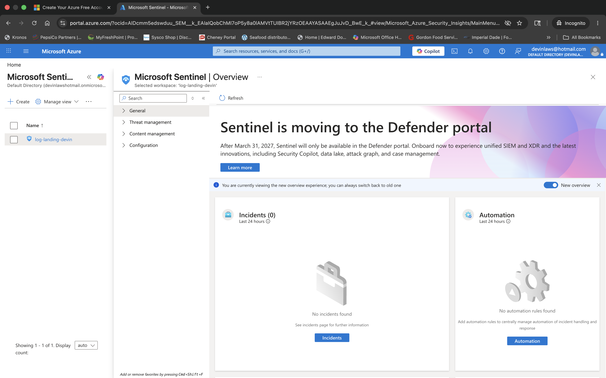
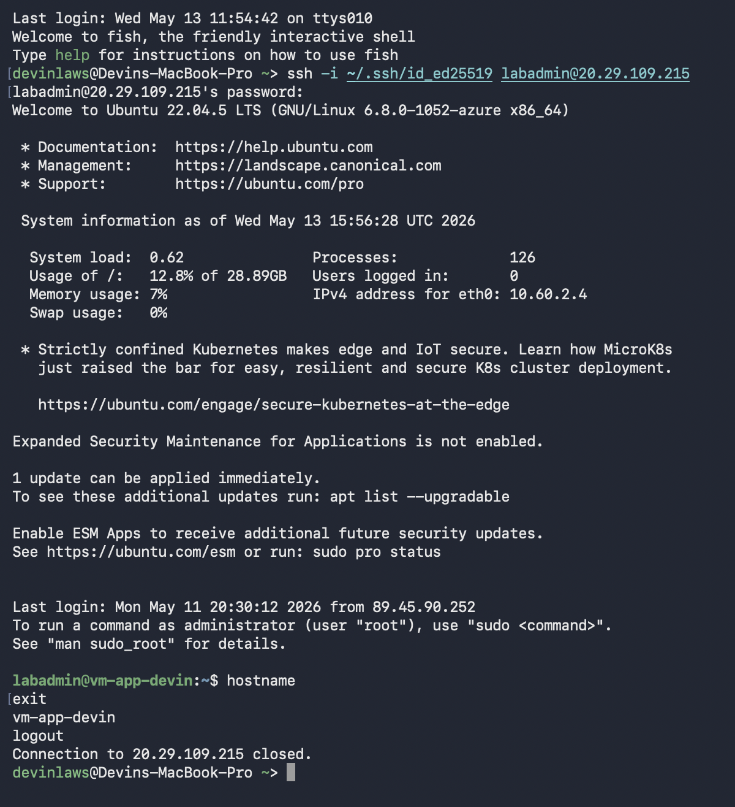
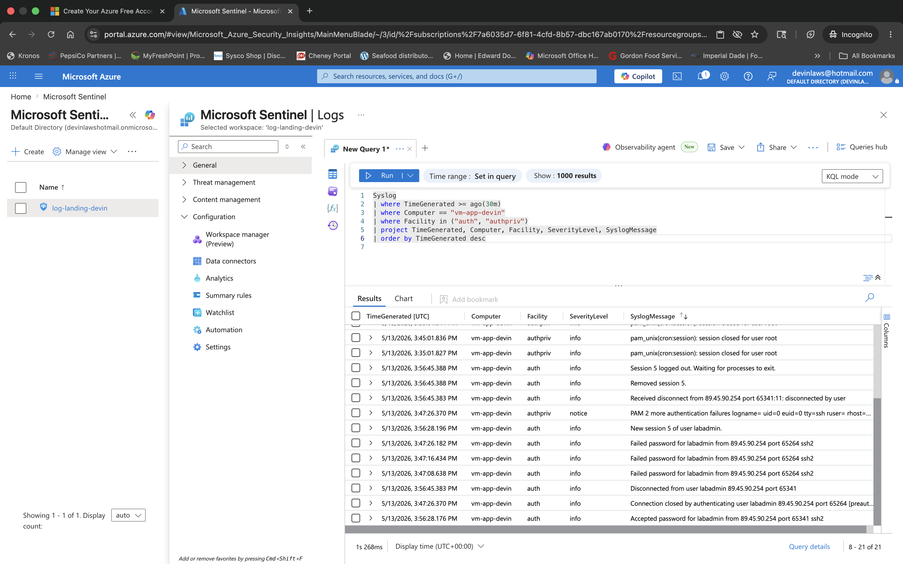
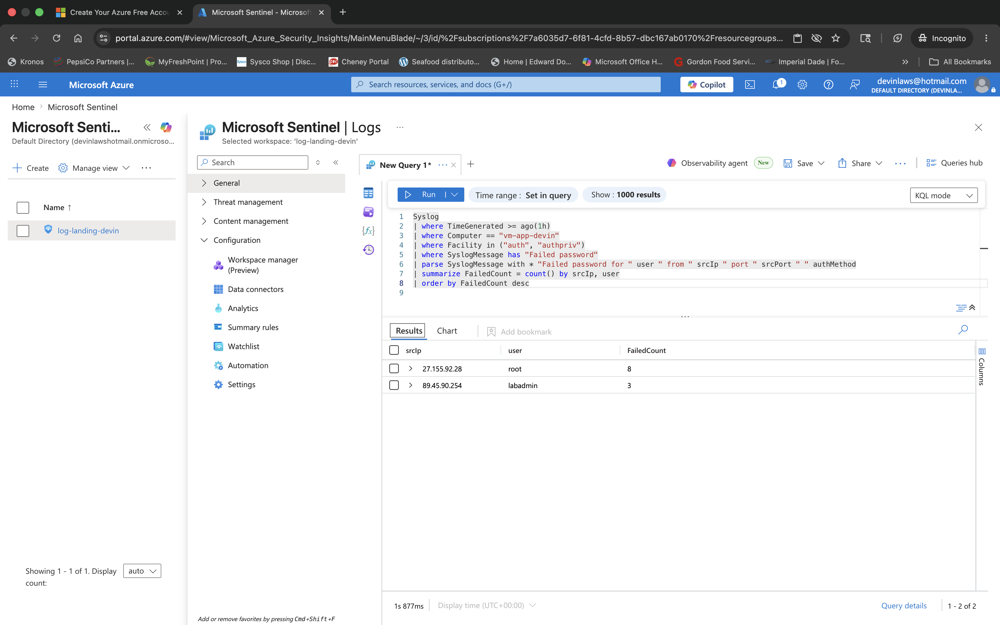
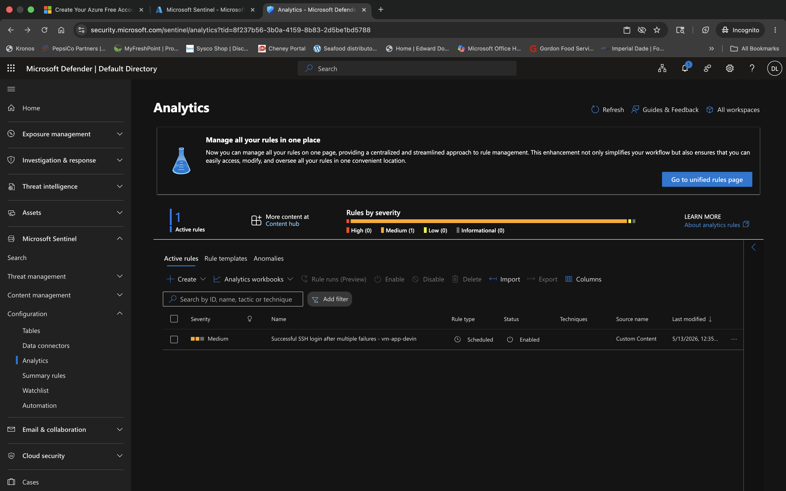

# Microsoft Sentinel Linux Security Monitoring

[](https://github.com/devinlaws50-wq/azure-sentinel-security-monitoring/actions/workflows/terraform-validate.yml)


## Project Overview

This project implements a Microsoft Sentinel security-monitoring workflow for Linux SSH authentication activity in Azure.

An Ubuntu workload VM generates authentication telemetry that is collected through the Azure Monitor Agent and ingested into a Log Analytics workspace. Microsoft Sentinel uses that data for KQL-based hunting and scheduled detection.

The primary detection use case identifies a **successful SSH login after multiple failed authentication attempts from the same source IP and user**.

The project demonstrates the full monitoring lifecycle:

* Infrastructure deployment with Terraform
* Linux authentication telemetry generation
* Syslog ingestion through Azure Monitor Agent
* Log Analytics validation
* KQL hunting and event correlation
* Scheduled Microsoft Sentinel analytics
* Detection testing with controlled authentication activity
* Automated Terraform validation with GitHub Actions

---

## Security Problem

Repeated failed authentication attempts followed by a successful login can indicate:

* Password guessing
* Credential stuffing
* Brute-force activity
* Compromised credentials
* Unauthorized access after repeated failures

Looking only at failed authentication events can generate noise. Looking only at successful logins can miss the context that made the login suspicious.

This project addresses that problem by correlating both event types.

The detection asks:

> Did the same source IP and user generate multiple failed SSH authentication attempts and then successfully authenticate within a short time window?

This creates a more meaningful security signal than monitoring either event independently.

---

## Detection Objective

The final detection logic identifies:

```text
3 or more failed SSH logins
        ↓
Same source IP
        ↓
Same username
        ↓
Successful authentication
        ↓
Within 15 minutes of the last failure
        ↓
Microsoft Sentinel detection
```

---

## Architecture

The monitoring flow begins with authentication activity against the Azure Linux VM.

```mermaid
flowchart LR
    A["Administrator Workstation"] -->|SSH attempts| B["Azure Linux VM<br/>vm-app-devin"]

    B --> C["Linux Authentication Logs<br/>auth / authpriv"]
    C --> D["Azure Monitor Agent"]
    D --> E["Log Analytics Workspace<br/>log-landing-devin"]
    E --> F["Microsoft Sentinel"]
    F --> G["KQL Hunting & Correlation"]
    G --> H["Scheduled Analytics Rule"]
    H --> I["Microsoft Defender Portal"]
```



### Data Flow

```text
SSH authentication
      ↓
Linux sshd / PAM
      ↓
Syslog auth + authpriv
      ↓
Azure Monitor Agent
      ↓
Log Analytics Syslog table
      ↓
Microsoft Sentinel
      ↓
KQL correlation
      ↓
Scheduled analytics rule
```

---

## Technologies Used

| Technology                | Purpose                                            |
| ------------------------- | -------------------------------------------------- |
| Microsoft Azure           | Cloud infrastructure platform                      |
| Microsoft Sentinel        | SIEM and detection platform                        |
| Log Analytics             | Centralized log storage and querying               |
| Azure Monitor Agent       | Linux Syslog collection                            |
| Ubuntu Linux              | Monitored workload                                 |
| Syslog                    | Authentication telemetry source                    |
| KQL                       | Hunting, aggregation, and correlation              |
| Microsoft Defender Portal | Sentinel analytics-rule management                 |
| SSH                       | Authentication activity used for detection testing |
| Terraform                 | Infrastructure as Code                             |
| Git                       | Source control                                     |
| GitHub Actions            | Automated Terraform validation                     |

---

## Security Controls and Monitoring

### Centralized Log Collection

Linux authentication activity is collected centrally rather than analyzed only on the VM.

Relevant facilities include:

```text
auth
authpriv
```

### Authentication Monitoring

The project analyzes:

```text
Failed password
Accepted password
Accepted publickey
```

events generated by SSH.

### Detection Correlation

Failed and successful authentication records are correlated by:

```text
Source IP
Username
Time
```

to identify suspicious login sequences.

### Scheduled Detection

The final KQL correlation logic is implemented as a scheduled Microsoft Sentinel analytics rule.

### Infrastructure Validation

GitHub Actions automatically runs:

```text
terraform fmt -check -recursive
terraform init -backend=false
terraform validate
```

on pushes to `main` and pull requests.

The CI workflow validates Terraform without deploying Azure resources or requiring Azure credentials.

---

## Implementation

### 1. Enabled Microsoft Sentinel

Microsoft Sentinel was enabled against the existing Log Analytics workspace:

```text
log-landing-devin
```

This allowed the workspace to be used for security hunting and scheduled analytics.



### 2. Verified Linux Syslog Collection

Linux authentication data was collected through the Azure Monitor Agent.

The project focused on the facilities:

```text
auth
authpriv
```

which contain SSH and PAM authentication activity.

### 3. Generated Controlled Authentication Activity

Multiple failed SSH authentication attempts were intentionally generated, followed by a successful authentication.

This created the telemetry required to test the detection logic end-to-end.

Example connection:

```bash
ssh -i ~/.ssh/id_ed25519 labadmin@<redacted-public-ip>
hostname
exit
```



---

## Log Validation

Before writing detection logic, raw telemetry was validated in the `Syslog` table.

```kusto
Syslog
| where TimeGenerated >= ago(30m)
| where Computer == "vm-app-devin"
| where Facility in ("auth", "authpriv")
| project TimeGenerated, Computer, Facility, SeverityLevel, SyslogMessage
| order by TimeGenerated desc
```

This confirmed that both failed and successful SSH authentication records were available for analysis.



---

## Failed SSH Detection

The first hunting query summarizes failed SSH authentication attempts by source IP and user.

```kusto
Syslog
| where TimeGenerated >= ago(1h)
| where Computer == "vm-app-devin"
| where Facility in ("auth", "authpriv")
| where SyslogMessage has "Failed password"
| parse SyslogMessage with * "Failed password for " user " from " srcIp " port " srcPort " " authMethod
| summarize FailedCount = count() by srcIp, user
| order by FailedCount desc
```

### What the Query Does

The query:

1. Limits analysis to recent events
2. Filters to the monitored VM
3. Selects authentication facilities
4. Finds failed-password events
5. Extracts the username and source IP
6. Counts failures by user and source
7. Sorts the most active sources first



---

## Success After Multiple Failures Detection

The final detection correlates failed authentication activity with a later successful login.

```kusto
let FailedLogons =
    Syslog
    | where TimeGenerated >= ago(1h)
    | where Computer == "vm-app-devin"
    | where Facility in ("auth", "authpriv")
    | where SyslogMessage has "Failed password"
    | parse SyslogMessage with * "Failed password for " user " from " srcIp " port " srcPort " " authMethod
    | summarize
        FailedCount = count(),
        FirstFailed = min(TimeGenerated),
        LastFailed = max(TimeGenerated)
        by srcIp, user;

let SuccessfulLogons =
    Syslog
    | where TimeGenerated >= ago(1h)
    | where Computer == "vm-app-devin"
    | where Facility in ("auth", "authpriv")
    | where SyslogMessage has "Accepted password"
        or SyslogMessage has "Accepted publickey"
    | parse SyslogMessage with * "Accepted " authMethod " for " user " from " srcIp " port " srcPort " " *
    | project
        SuccessTime = TimeGenerated,
        srcIp,
        user,
        authMethod;

FailedLogons
| join kind=inner SuccessfulLogons on srcIp, user
| where SuccessTime >= LastFailed
| where SuccessTime <= LastFailed + 15m
| where FailedCount >= 3
| project
    srcIp,
    user,
    FailedCount,
    FirstFailed,
    LastFailed,
    SuccessTime,
    authMethod
| order by SuccessTime desc
```

### Detection Logic

The rule identifies cases where:

```text
FailedCount >= 3
```

and the successful authentication occurs:

```text
after the last failed attempt
```

but no later than:

```text
15 minutes after the last failure
```

for the same:

```text
srcIp + user
```

This turns individual authentication records into a correlated security event.

---

## Scheduled Analytics Rule

The final KQL detection was configured as a scheduled analytics rule in Microsoft Sentinel through the Microsoft Defender portal.

The detection monitors for:

> A successful SSH authentication after three or more failed authentication attempts from the same source IP and user.



---

## Validation

The project was considered successfully validated when all of the following were confirmed:

* Linux authentication events appeared in the `Syslog` table
* `auth` and `authpriv` telemetry was present
* Failed SSH authentication events were visible
* Successful authentication events were visible
* Failed attempts could be grouped by source IP
* The correlation query returned the expected source/user combination
* The successful login occurred after the failed attempts
* The scheduled analytics rule validated successfully
* Terraform configuration passed GitHub Actions CI

This test-driven process verified the entire path from endpoint activity to SIEM detection.

---

## Challenges and Troubleshooting

### Defender Portal Transition

Sentinel analytics management redirected from the Azure portal into the Microsoft Defender portal.

The scheduled rule workflow therefore had to be completed through Defender rather than relying on the older Azure-only management experience.

### Analytics Rule Validation

The scheduled-rule wizard initially failed validation.

The issue was resolved by cleaning up the KQL query and ensuring all scheduling fields were populated correctly.

### SSH Key Path

Initial SSH testing used an incorrect identity-file path.

The correct key:

```text
~/.ssh/id_ed25519
```

was then used successfully.

### Detection Testing

Creating a saved rule alone does not prove that the detection works.

Controlled failed and successful authentication events were generated so the KQL logic could be validated against actual telemetry.

---

## Security Considerations

This project demonstrates several security-monitoring principles:

* Authentication activity is collected centrally.
* Failed and successful logins are analyzed together.
* Detection logic uses multiple contextual fields rather than a single event.
* KQL is tested against controlled activity before being operationalized.
* Infrastructure is defined through Terraform.
* Terraform state and local variable files are excluded from source control.
* CI validation does not require Azure credentials.
* Public addresses shown in documentation are redacted or represented with placeholders.

For a production environment, additional considerations would include:

* Alert severity and incident grouping
* Entity mapping
* Service-account exclusions
* Known administrative-source exclusions
* Dynamic thresholds
* Watchlists
* Threat-intelligence enrichment
* GeoIP enrichment
* UEBA
* False-positive tuning
* Automated incident response
* Longer retention requirements
* Cross-host authentication correlation

---

## Cost Considerations

Microsoft Sentinel and Log Analytics can generate costs based on data ingestion, retention, and enabled services.

Azure VM compute also incurs charges while the monitored workload is running.

For lab environments:

* Stop or deallocate VMs when testing is complete.
* Monitor Log Analytics ingestion volume.
* Review Sentinel and workspace retention settings.
* Remove unused Azure resources.
* Use Azure Cost Management to monitor spending.

---

## Cleanup

After validation:

1. Stop or deallocate the Ubuntu VM if the environment will be reused.
2. Destroy Terraform-managed resources when they are no longer needed.
3. Review Log Analytics and Sentinel resources that may continue generating charges.

For Terraform-managed infrastructure:

```bash
terraform destroy
```

Review the destruction plan before confirming.

Because Terraform state is intentionally excluded from Git, destruction must be performed from the environment containing the matching Terraform state.

---

## Key Outcomes

This project demonstrated the ability to:

* Enable Microsoft Sentinel on an existing Log Analytics workspace
* Onboard Linux authentication telemetry
* Validate Syslog ingestion through Azure Monitor Agent
* Generate controlled security events
* Hunt authentication activity with KQL
* Parse usernames and source IP addresses from Syslog
* Aggregate failed login attempts
* Correlate failed and successful authentication activity
* Build a scheduled Sentinel analytics rule
* Validate detection logic end-to-end
* Troubleshoot SIEM configuration issues
* Connect Infrastructure as Code to a security-monitoring use case
* Implement automated Terraform validation through GitHub Actions

---

## Skills Demonstrated

```text
Microsoft Sentinel
SIEM
Detection Engineering
Kusto Query Language
KQL
Log Analytics
Azure Monitor Agent
Linux
Ubuntu
Syslog
SSH
Authentication Monitoring
Threat Detection
Security Monitoring
Incident Detection
Log Parsing
Event Correlation
Microsoft Defender Portal
Terraform
Infrastructure as Code
Azure
Git
GitHub
GitHub Actions
CI/CD
Security Validation
```

---

## Repository Structure

```text
.
├── .github/
│   └── workflows/
│       └── terraform-validate.yml
├── screenshots/
│   ├── 01-enable-sentinel-workspace.png
│   ├── 02-ssh-success.png
│   ├── 03-syslog-ssh-events.png
│   ├── 04-failed-ssh-by-ip.png
│   └── 05-analytic-rule-ssh-success-after-failures.png
├── .gitignore
├── .terraform.lock.hcl
├── main.tf
├── outputs.tf
├── README.md
├── screenshot-list.txt
├── terraform.tfvars.example
└── variables.tf
```

---

## Future Improvements

Future iterations could extend the detection environment with:

* Microsoft Sentinel Watchlists
* Known-bad IP enrichment
* Threat-intelligence correlation
* Sudo privilege-escalation detections
* Impossible-travel or unusual-location analysis
* Additional Linux persistence detections
* Sentinel Workbooks
* Authentication trend dashboards
* Alert entity mapping
* Incident grouping
* Automated response playbooks
* MITRE ATT&CK mapping
* Detection-as-code workflows

---

## Author

**Devin Laws**
Systems Administrator | Cloud Infrastructure & Security

[LinkedIn](https://linkedin.com/in/dlaws2030) | [GitHub](https://github.com/devinlaws50-wq)
